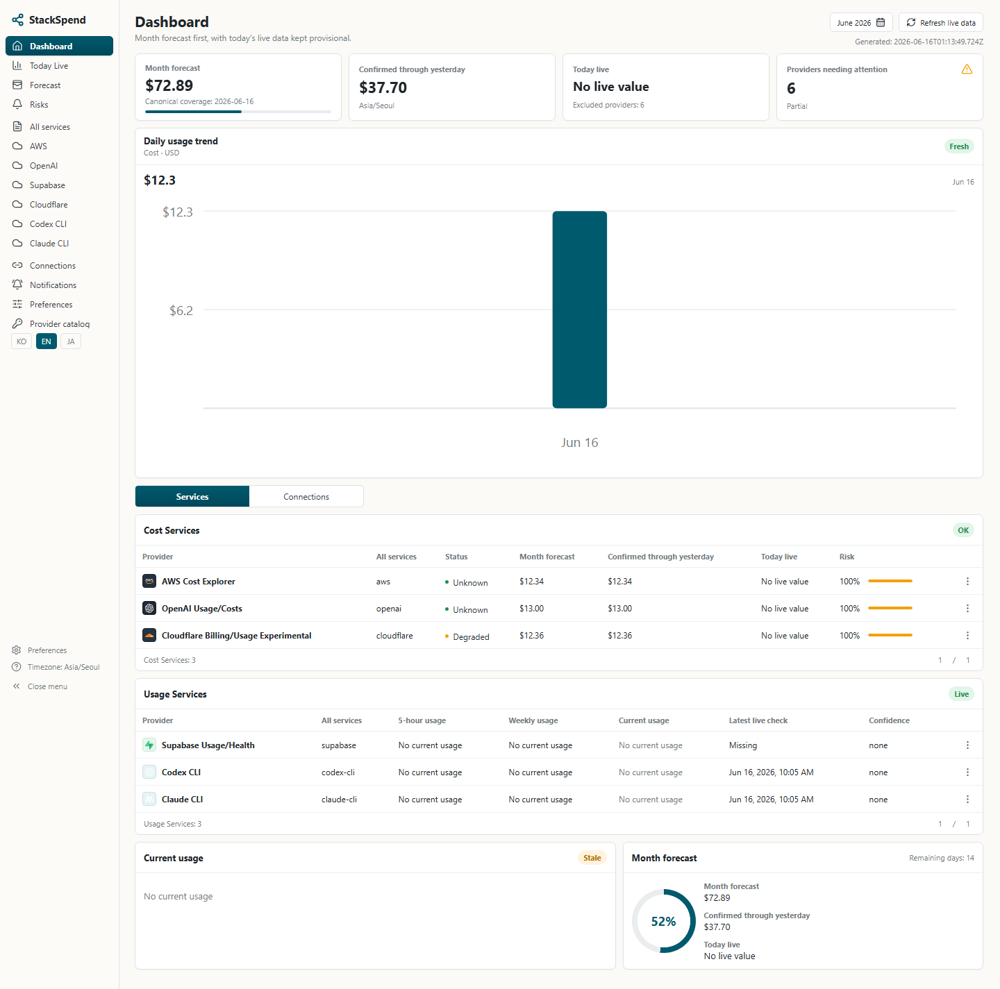
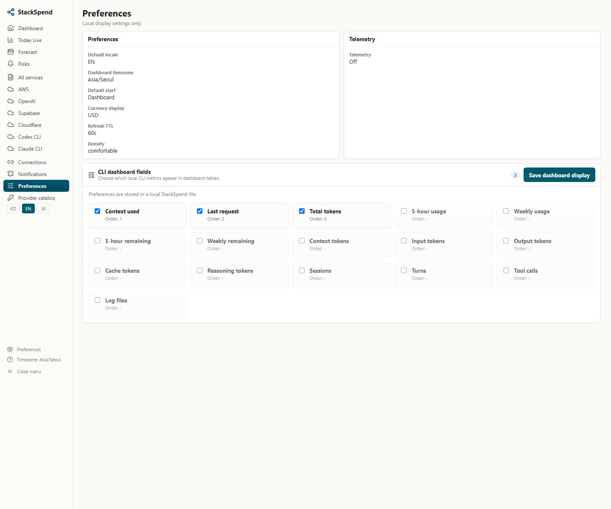
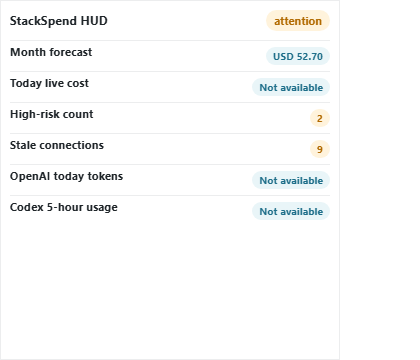
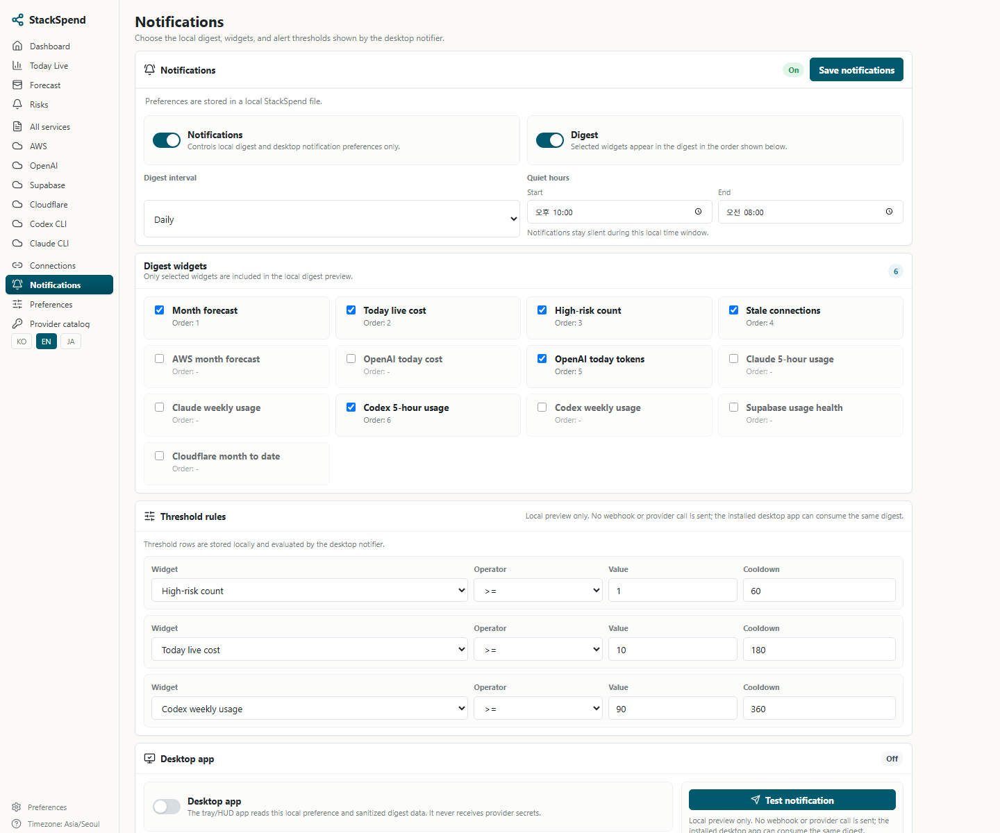
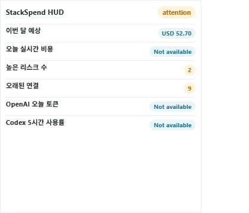

# Windows and macOS Install Guide

MoneySiren is a local-first cloud, SaaS, and AI usage dashboard. The initial public local release has three local surfaces:

- CLI automation through `moneysiren` or the shorter `msiren` alias.
- Local web dashboard through Next.js.
- Desktop tray/notifier and HUD through the native Tauri shell.

The recommended npm app package installs the CLI command surface and source-free local web dashboard runtime without cloning this repository. Native desktop tray/HUD artifacts are installed from GitHub Releases when signed metadata is available, or when a local tester explicitly opts in to unsigned HUD smoke testing.

## Requirements

Use Node.js 22.13 or newer for source-free npm installs.

Required for `npm install -g @moneysiren/app`:

- Node.js 22.13 or newer.

Required only for source development:

- Node.js 22.13 or newer.
- pnpm 11.5.0 through Corepack.
- Git.
- Node.js with the SQLite runtime, or `sqlite3` on `PATH`/`MONEYSIREN_SQLITE_BIN` as a fallback.

Required only when building the native desktop tray/HUD from source:

- Rust and Cargo.
- Windows: WebView2 Runtime and Visual Studio Build Tools with the Desktop development with C++ workload.
- macOS: Xcode Command Line Tools, or Xcode.

Do not create `.env` files with live credentials. For v0.1, use process-local environment variables only.

## Install The App From npm

For normal source-free installs, install the app package with npm.

Windows PowerShell:

```powershell
npm install -g @moneysiren/app
msiren --version
msiren install --status
msiren modes
msiren doctor
msiren install --web
msiren sync --provider mock
msiren start
msiren hud
```

macOS zsh:

```bash
npm install -g @moneysiren/app
msiren --version
msiren install --status
msiren modes
msiren doctor
msiren install --web
msiren sync --provider mock
msiren start
msiren hud
```

During global npm installs, `@moneysiren/app` creates the command aliases and downloads the matching GitHub Release web runtime. Until Windows HUD signing is ready, unsigned HUD artifact installation requires explicit local opt-in with `msiren install --hud --allow-unsigned-hud`. The app package creates both command aliases during postinstall:

- `moneysiren`
- `msiren`

If npm reports `EEXIST` for `moneysiren` or `msiren`, an older prerelease `@moneysiren/app` with npm-managed bin aliases may still be installed. Remove the old global packages and reinstall:

```powershell
npm uninstall -g @moneysiren/cli @moneysiren/app
npm install -g @moneysiren/app --force
```

If release asset download fails during postinstall, npm still installs the command. Fix network or release access, then rerun:

```bash
msiren install --web
msiren install --status
msiren doctor
```

If `msiren install --web` reports `404 Not Found` for the configured `ztwz11/moneysiren@v*` release tag, the source-free web dashboard runtime has not been published for that tag. The CLI is still installed, and `msiren sync --provider mock` can create local fake snapshots, but `msiren start` needs the matching GitHub Release web runtime. Use the source install path below until the release asset is published.

For CLI-only automation, install `@moneysiren/cli` instead. Run `msiren install --all` only when Web/HUD assets are needed.

`msiren modes` should show the selected install profile plus the CLI, local web dashboard/runtime, and desktop tray/notifier surfaces. The same source tree supports Windows and macOS; npm installs the cross-platform command surface, while native tray/HUD artifacts are built per OS.

## Install Desktop Release Without Cloning Source

GitHub Releases publish three source-free artifact types:

- `moneysiren-web-runtime-*.tar.gz`: the built local Next.js dashboard runtime.
- Windows installer: signed Tauri NSIS `.exe` when release signing credentials are configured.
- macOS app archive: signed and notarized Tauri `.app` inside `.tar.gz` when Apple release signing credentials are configured.

Install the app package first:

```bash
npm install -g @moneysiren/app
msiren install --web
msiren doctor
msiren sync --provider mock
msiren start
msiren hud
```

`@moneysiren/app` bundles the CLI command and downloads the web runtime archive during global npm installs. HUD artifacts remain behind signed release metadata by default; before signing is ready, local testers can opt in with `msiren install --hud --allow-unsigned-hud`. By default, installed files are stored in the MoneySiren local application data directory. `msiren start` extracts and starts the installed web runtime, then opens the local dashboard. `msiren hud` ensures that runtime is running and launches the desktop HUD shell when a runnable desktop app is installed or configured.

For CLI-only automation, install `@moneysiren/cli` instead and run `msiren install --all` later if Web/HUD assets are needed.

To pin a release tag or choose a directory for the web runtime:

```bash
msiren install --web --tag v0.1.7-beta.5 --dir ./moneysiren-release
```

If the desktop installer was installed to a non-default location, point the CLI at it before opening HUD:

```bash
MONEYSIREN_DESKTOP_APP="<path-to-installed-MoneySiren-app>" msiren hud
```

The web runtime listens at `http://127.0.0.1:3000` by default. The native shell opens the dashboard and HUD from that local address.

This initial public local desktop shell is still a thin local shell. The CLI owns the source-free startup path, while Windows and macOS may warn when using local unsigned builds.

MoneySiren is prepared to use the SignPath Foundation program for open-source Windows code signing. When a Windows Release artifact is signed through the SignPath Foundation, the GitHub Release notes and this install guide will identify that signature path so users can distinguish signed desktop artifacts from local unsigned builds.

## Install From Source On Windows

Install prerequisites:

```powershell
winget install OpenJS.NodeJS.LTS
winget install Git.Git
winget install SQLite.SQLite
winget install Rustlang.Rustup
winget install Microsoft.EdgeWebView2Runtime
```

Install Visual Studio Build Tools 2022 with the Desktop development with C++ workload if you want to build the native tray.

Clone and install:

```powershell
git clone https://github.com/ztwz11/moneysiren.git
cd moneysiren
corepack enable
corepack prepare pnpm@11.5.0 --activate
pnpm install
```

Create a local SQLite database and seed safe demo data:

```powershell
New-Item -ItemType Directory -Force .moneysiren | Out-Null
$root = (Get-Location).Path
$env:MONEYSIREN_DB_PATH = Join-Path $root ".moneysiren\moneysiren.sqlite"

pnpm --filter moneysiren dev -- init
pnpm --filter moneysiren dev -- sync --provider mock

$env:MONEYSIREN_AWS_COST_EXPLORER_FIXTURE = Join-Path $root "tests\fixtures\providers\aws\cost-explorer-grouped-by-service.json"
$env:MONEYSIREN_OPENAI_USAGE_FIXTURE = Join-Path $root "tests\fixtures\providers\openai\usage-costs.json"
$env:MONEYSIREN_OPENAI_COSTS_FIXTURE = Join-Path $root "tests\fixtures\providers\openai\usage-costs.json"
$env:MONEYSIREN_SUPABASE_FIXTURE = Join-Path $root "tests\fixtures\providers\supabase\usage-health.json"
$env:MONEYSIREN_CLOUDFLARE_FIXTURE = Join-Path $root "tests\fixtures\providers\cloudflare\billing-usage.json"

pnpm --filter moneysiren dev -- sync --provider aws
pnpm --filter moneysiren dev -- sync --provider openai
pnpm --filter moneysiren dev -- sync --provider supabase
pnpm --filter moneysiren dev -- sync --provider cloudflare
```

Run the web dashboard with fake connection labels for demo display only:

```powershell
$env:AWS_PROFILE = "FAKE_MONEYSIREN_INSTALL_GUIDE_PROFILE"
$env:OPENAI_ADMIN_KEY = "FAKE_MONEYSIREN_INSTALL_GUIDE_OPENAI_ADMIN_KEY"
$env:SUPABASE_ACCESS_TOKEN = "FAKE_MONEYSIREN_INSTALL_GUIDE_SUPABASE_ACCESS_TOKEN"
$env:CLOUDFLARE_API_TOKEN = "FAKE_MONEYSIREN_INSTALL_GUIDE_CLOUDFLARE_API_TOKEN"
$env:CLOUDFLARE_ACCOUNT_IDS = "FAKE_MONEYSIREN_INSTALL_GUIDE_ACCOUNT_ID"

npm run dev:web
```

For live AWS SSO, `aws sso login --profile <profile>` refreshes the SSO cache but does not set `AWS_PROFILE` in the current shell. Use `pnpm --filter moneysiren dev -- sync --provider aws --profile <profile>` or set `$env:AWS_PROFILE` before syncing.

Open:

- `http://127.0.0.1:3000/en/dashboard/overview`
- `http://127.0.0.1:3000/hud?locale=en`

Run the native tray/HUD during development:

```powershell
npm run dev
```

Build an unsigned Windows desktop installer:

```powershell
npm run build:native
Get-ChildItem apps\tray\src-tauri\target\release\bundle\nsis\*.exe
```

The exact installer filename can change by version.

## Install From Source On macOS

Install prerequisites:

```bash
xcode-select --install
brew install node git sqlite
corepack enable
corepack prepare pnpm@11.5.0 --activate
```

Install Rust from `https://rustup.rs/`, then restart the terminal or source Cargo's env file.

Clone and install:

```bash
git clone https://github.com/ztwz11/moneysiren.git
cd moneysiren
pnpm install
```

Create a local SQLite database and seed safe demo data:

```bash
mkdir -p .moneysiren
export MONEYSIREN_ROOT="$PWD"
export MONEYSIREN_DB_PATH="$MONEYSIREN_ROOT/.moneysiren/moneysiren.sqlite"

pnpm --filter moneysiren dev -- init
pnpm --filter moneysiren dev -- sync --provider mock

export MONEYSIREN_AWS_COST_EXPLORER_FIXTURE="$MONEYSIREN_ROOT/tests/fixtures/providers/aws/cost-explorer-grouped-by-service.json"
export MONEYSIREN_OPENAI_USAGE_FIXTURE="$MONEYSIREN_ROOT/tests/fixtures/providers/openai/usage-costs.json"
export MONEYSIREN_OPENAI_COSTS_FIXTURE="$MONEYSIREN_ROOT/tests/fixtures/providers/openai/usage-costs.json"
export MONEYSIREN_SUPABASE_FIXTURE="$MONEYSIREN_ROOT/tests/fixtures/providers/supabase/usage-health.json"
export MONEYSIREN_CLOUDFLARE_FIXTURE="$MONEYSIREN_ROOT/tests/fixtures/providers/cloudflare/billing-usage.json"

pnpm --filter moneysiren dev -- sync --provider aws
pnpm --filter moneysiren dev -- sync --provider openai
pnpm --filter moneysiren dev -- sync --provider supabase
pnpm --filter moneysiren dev -- sync --provider cloudflare
```

Run the web dashboard with fake connection labels for demo display only:

```bash
export AWS_PROFILE="FAKE_MONEYSIREN_INSTALL_GUIDE_PROFILE"
export OPENAI_ADMIN_KEY="FAKE_MONEYSIREN_INSTALL_GUIDE_OPENAI_ADMIN_KEY"
export SUPABASE_ACCESS_TOKEN="FAKE_MONEYSIREN_INSTALL_GUIDE_SUPABASE_ACCESS_TOKEN"
export CLOUDFLARE_API_TOKEN="FAKE_MONEYSIREN_INSTALL_GUIDE_CLOUDFLARE_API_TOKEN"
export CLOUDFLARE_ACCOUNT_IDS="FAKE_MONEYSIREN_INSTALL_GUIDE_ACCOUNT_ID"

npm run dev:web
```

For live AWS SSO, `aws sso login --profile <profile>` refreshes the SSO cache but does not set `AWS_PROFILE` in the current shell. Use `pnpm --filter moneysiren dev -- sync --provider aws --profile <profile>` or export `AWS_PROFILE` before syncing.

Open:

- `http://127.0.0.1:3000/en/dashboard/overview`
- `http://127.0.0.1:3000/hud?locale=en`

Run the native tray/HUD during development:

```bash
npm run dev
```

Build an unsigned macOS desktop app:

```bash
npm run build:native
open "apps/tray/src-tauri/target/release/bundle/macos/MoneySiren Tray.app"
```

If macOS blocks an unsigned local development app, use Finder, right-click the app, and choose Open. Distribution is allowed only through the explicitly gated unsigned prerelease path described below; stable releases still require Apple signing and notarization.

## Maintainer Desktop Release

The `desktop-release` GitHub Actions workflow builds source-free local release assets for GitHub Releases:

- Windows NSIS installer from the Windows runner.
- macOS `.app` archive from the macOS runner.
- Web runtime archive from the Linux runner.

Before creating a public desktop release, configure signing secrets outside the repository. Windows needs a trusted code-signing PFX/P12 certificate; self-signed certificates are useful only for local smoke tests and do not fix public Windows publisher trust warnings.

Prepare the Windows certificate payload without printing it to the terminal:

```bash
npm run release:signing:encode-windows -- "<path-to-windows-code-signing.pfx>"
```

Set GitHub repository secrets:

- `WINDOWS_CERTIFICATE`: contents of `.tmp/codesign/windows-certificate.base64.txt`.
- `WINDOWS_CERTIFICATE_PASSWORD`: the PFX/P12 password.

Then verify the local signing inputs:

PowerShell:

```powershell
$env:WINDOWS_CERTIFICATE_PASSWORD = "<pfx-or-p12-password>"
npm run release:signing:check -- windows
```

Bash/zsh:

```bash
WINDOWS_CERTIFICATE_PASSWORD="<pfx-or-p12-password>" npm run release:signing:check -- windows
```

Create or update the public release with the guarded release script:

```bash
npm run release:public:dry-run
npm run release:public
```

`release:public` creates and pushes the annotated `v*` tag after validation. It does not run `npm publish` locally; the tag-push GitHub Actions workflow owns npm publishing and GitHub Release asset creation. If only one signing identity is ready, run the workflow manually from GitHub Actions with `desktop_targets` set to `windows` or `macos`; skipped desktop assets are removed from the updated GitHub Release so stale unsigned desktop artifacts do not remain published. The workflow uploads SHA256 checksum files and platform trust metadata next to the release artifacts. Signed macOS archives are verified with `codesign`, `stapler`, and `spctl` before upload.

Unsigned Windows HUD artifacts are allowed only for explicit prerelease or local smoke review paths. Keep unsigned validation explicit and out of the public release check:

```bash
npm run release:check -- v0.1.0-rc.1 --allow-unsigned-prerelease-windows
```

Before SignPath or another trusted Windows signing path is ready, local HUD smoke testers must opt in explicitly:

```powershell
msiren install --hud --allow-unsigned-hud
msiren hud
```

This opt-in accepts an unsigned Windows HUD artifact only for that command. It does not change public release validation and does not remove Windows publisher warnings. Without the explicit flag, public release HUD installs still require Windows signature metadata. `MONEYSIREN_ALLOW_UNSIGNED_HUD=true` remains available for advanced npm postinstall or CI smoke paths. For prerelease tags such as `alpha`, `beta`, or `rc`, set `MONEYSIREN_ALLOW_UNSIGNED_HUD=false` to require signed HUD metadata even for prerelease builds.

### Install an unsigned Windows preview

An unsigned preview is a prerelease, not a stable release. Install the npm `next` channel and explicitly accept the unsigned HUD artifact for the matching tag:

```powershell
npm install -g @moneysiren/app@next
msiren install --hud --allow-unsigned-hud --tag v0.1.7-beta.5
```

The release must provide `moneysiren-tray-windows-SHA256SUMS.txt` and `moneysiren-tray-windows-UNSIGNED-PREVIEW.json`. The CLI verifies the SHA256 entry before installation, but Windows may still show Unknown Publisher or SmartScreen warnings and managed Windows policy may block execution. Do not turn off Defender, SmartScreen, or Smart App Control globally to install a preview.

### Install an unsigned macOS preview

Without Apple Developer credentials, manually dispatch `desktop-release` with a prerelease tag, `desktop_targets=macos` (or `all`), and `unsigned_macos_preview=true`. Stable tag pushes and dispatches without all three gates fail closed.

Install the matching npm `next` package and opt in to the unsigned app:

```bash
npm install -g @moneysiren/app@next
msiren install --hud --allow-unsigned-hud --tag v0.1.7-beta.5
msiren hud
```

The release must provide `moneysiren-tray-macos-SHA256SUMS.txt` and `moneysiren-tray-macos-UNSIGNED-PREVIEW.json`. The public smoke verifies those files are bound to the prerelease tag and source commit. Gatekeeper may still block first launch; approve only the MoneySiren app through Finder > Open or System Settings > Privacy & Security. Never disable Gatekeeper globally.

Before announcing the preview, verify its published checksum and metadata boundary:

```bash
node tools/scripts/check-release-readiness.mjs \
  --tag v0.1.7-beta.5 \
  --allow-unsigned-prerelease-macos \
  --source-commit <40-hex-sha>
```

## English Mock Screenshots

The following screenshots were regenerated from a fresh fixture-backed SQLite database seeded by the commands above. The fake environment values only mark providers as connected for the local UI; no live provider credentials, provider account identifiers, webhook URLs, or local Codex/Claude session data are included.

Dashboard overview:



CLI dashboard field settings:



Desktop HUD:



Notification and HUD settings:



## Korean Mock Screenshots

The following screenshots use the same fixture-backed SQLite database and Korean UI routes. The fake environment values only mark providers as connected for the local UI; no live provider credentials, provider account identifiers, webhook URLs, or local Codex/Claude session data are included.

Dashboard overview:


CLI dashboard field settings:


Desktop HUD:



Notification and HUD settings:


## Validation

For a local source checkout, run:

```bash
pnpm test
pnpm typecheck
git diff --check
```

For a narrower documentation-only change, at minimum run:

```bash
git diff --check -- README.md docs/install.md
```

## Security Notes

- Fixture sync commands use committed fake payloads under `tests/fixtures/providers`.
- The `FAKE_MONEYSIREN_INSTALL_GUIDE_*` values are examples only.
- Do not commit `.env`, API keys, account IDs, project IDs, invoice IDs, card data, emails from provider payloads, raw billing profiles, or webhook URLs.
- Provider connectors must remain read-only.
- Telemetry is off by default.
